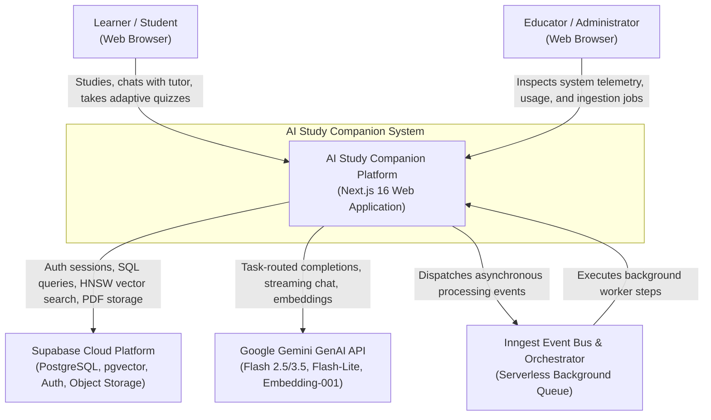
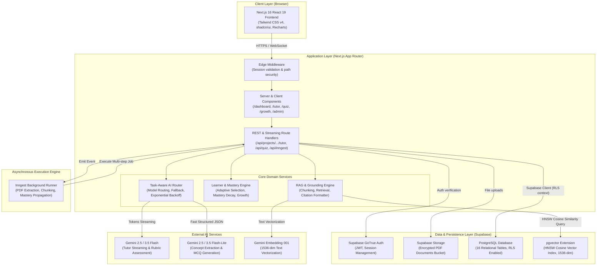
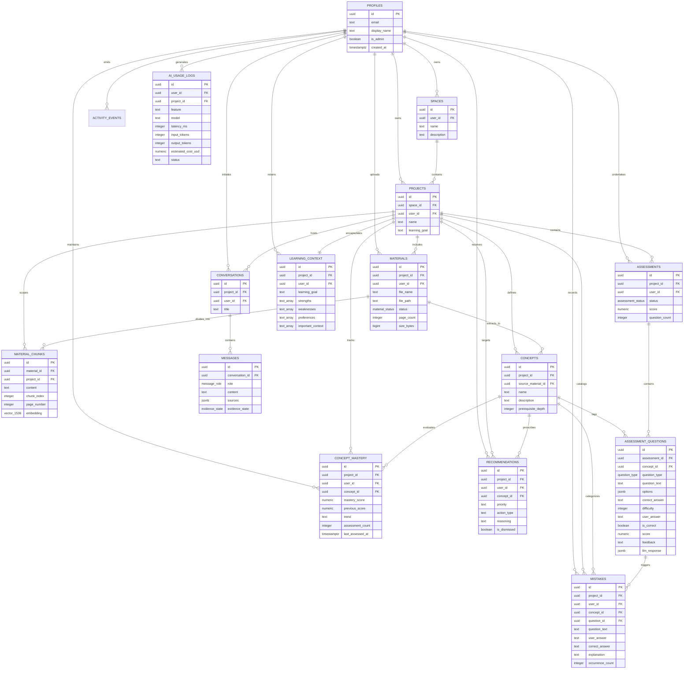
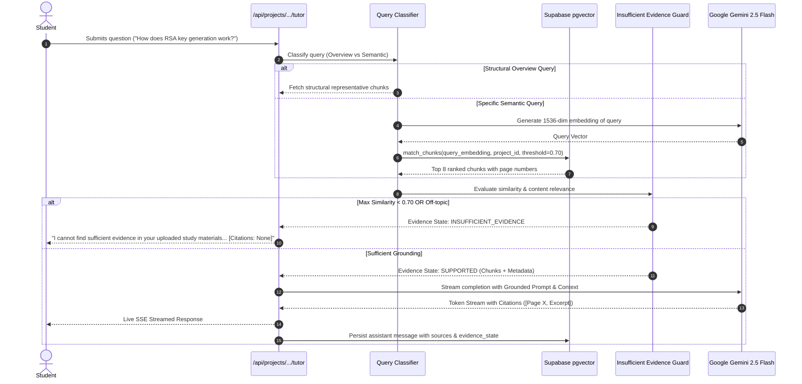
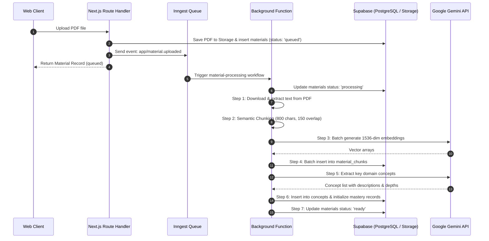

# AI Study Companion — System Architecture Document
**Version:** 3.0 (Production / Google Gemini Architecture)  
**Classification:** Technical Architecture Specification & Design Blueprint  
**Target Platform:** Next.js 16 (React 19, Turbopack) · Supabase (PostgreSQL 15+, pgvector, Auth, Storage) · Google Gemini AI (`@google/genai`) · Inngest v4  

---

## 1. Executive Summary & Problem Space

### 1.1 Problem Statement
Traditional digital learning tools function as passive document repositories or disconnected CRUD flashcard systems. When conventional generative AI is applied, it introduces significant risks:
- **Ungrounded Hallucinations:** Generic LLMs invent facts, formulas, and references when answering domain-specific inquiries.
- **Disconnected Learning Loops:** Quizzes are disconnected from study chat, mastery is untracked, and review recommendations are arbitrary or absent.
- **Lack of Multi-Tenant Isolation:** Multi-user platforms frequently fail to enforce strict data boundaries at the database engine level, risking data leakage between students.
- **Shallow Assessment:** Traditional tools rely solely on binary multiple-choice questions without assessing deep conceptual explanations against structured rubrics.

### 1.2 System Mission
**AI Study Companion** transforms static course materials into an active, adaptive, and evidence-grounded cognitive learning partner. It implements a closed-loop learning architecture:
1. Upload & parse course materials into strictly isolated spaces and projects.
2. Ingest, chunk, and embed content into 1536-dimensional vector representations.
3. Facilitate Socratic conversational learning with rigorous page citations and a strict Insufficient Evidence Guard.
4. Synthesize adaptive assessments dynamically weighted against 7 learner signals.
5. Grade open-ended responses against multi-dimensional rubrics (Accuracy, Conceptual Depth, Missing Concepts).
6. Deterministically update concept mastery and provide targeted, actionable remediation recommendations.

---

## 2. High-Level Architectural Topology (C4 Model)

### 2.1 System Context (C4 Level 1)



---

### 2.2 Container Architecture (C4 Level 2)



---

## 3. Data Architecture & Relational Topology

The database runs on **PostgreSQL 15+** with the **`pgvector`** extension enabled. It enforces multi-tenant isolation, referential integrity with cascading deletes, and automated timestamp triggers.

### 3.1 Entity-Relationship Diagram (ERD)



---

### 3.2 Vector Search Engine (`match_chunks`)
The semantic vector similarity search is executed in PostgreSQL using the pgvector `hnsw` index (`vector_cosine_ops`).

```sql
create or replace function public.match_chunks(
  query_embedding  vector(1536),
  match_project_id uuid,
  match_count      int   default 8,
  match_threshold  float default 0.70
)
returns table (
  id          uuid,
  material_id uuid,
  content     text,
  page_number integer,
  similarity  float
)
language plpgsql
stable
security definer
set search_path = public
as $$
begin
  -- Enforce strict Project Data Isolation
  if not (
    current_user in ('postgres', 'service_role')
    or auth.role() = 'service_role'
    or public.is_admin()
    or exists (
      select 1 from public.projects p
      where p.id = match_project_id and p.user_id = auth.uid()
    )
  ) then
    return;
  end if;

  return query
  select
    mc.id,
    mc.material_id,
    mc.content,
    mc.page_number,
    (1 - (mc.embedding <=> query_embedding))::float as similarity
  from public.material_chunks mc
  where
    mc.project_id = match_project_id
    and mc.embedding is not null
    and (1 - (mc.embedding <=> query_embedding)) > match_threshold
  order by mc.embedding <=> query_embedding
  limit match_count;
end;
$$;
```

---

## 4. Multi-Tenant Security & Isolation Matrix

Data isolation is enforced at the database engine tier through PostgreSQL Row-Level Security (RLS). Application bugs cannot cause cross-tenant leaks because queries without ownership predicates return zero rows.

### 4.1 RLS Policy Coverage Matrix

| Table | Policy Name | Permitted Roles | Enforcement Logic |
| :--- | :--- | :--- | :--- |
| `profiles` | `users_own_profile` | `authenticated` | `auth.uid() = id` (read & write own profile) |
| `profiles` | `admins_read_all_profiles`| `authenticated` (admin) | `public.is_admin() = true` |
| `spaces` | `spaces_owner` | `authenticated` | `auth.uid() = user_id` |
| `projects` | `projects_owner` | `authenticated` | `auth.uid() = user_id` |
| `materials` | `materials_owner` | `authenticated` | `auth.uid() = user_id` |
| `material_chunks`| `material_chunks_project_owner`| `authenticated` | `EXISTS (projects WHERE id = project_id AND user_id = auth.uid())` |
| `concepts` | `concepts_project_owner`| `authenticated` | `EXISTS (projects WHERE id = project_id AND user_id = auth.uid())` |
| `conversations`| `conversations_owner` | `authenticated` | `auth.uid() = user_id` |
| `messages` | `messages_conversation_owner`| `authenticated`| `EXISTS (conversations WHERE id = conversation_id AND user_id = auth.uid())` |
| `concept_mastery`| `concept_mastery_owner`| `authenticated` | `auth.uid() = user_id` |
| `assessments` | `assessments_owner` | `authenticated` | `auth.uid() = user_id` |
| `assessment_questions`| `assessment_questions_owner`| `authenticated`| `EXISTS (assessments WHERE id = assessment_id AND user_id = auth.uid())` |
| `mistakes` | `mistakes_owner` | `authenticated` | `auth.uid() = user_id` |
| `recommendations`| `recommendations_owner`| `authenticated` | `auth.uid() = user_id` |
| `learning_context`| `learning_context_owner`| `authenticated`| `auth.uid() = user_id` |
| `activity_events`| `activity_events_select`| `authenticated` | `auth.uid() = user_id OR public.is_admin()` |
| `ai_usage_logs`| `ai_usage_logs_admin_read`| `authenticated` (admin) | `public.is_admin()` (Writes reserved to service_role) |

### 4.2 Anti-Recursion Administrator RBAC
To check if a user is an administrator without creating recursive RLS loops on the `profiles` table, the platform uses a dedicated `security definer` function with explicit search paths:

```sql
create or replace function public.is_admin()
returns boolean
language sql
security definer
set search_path = public
stable
as $$
  select coalesce(
    (select is_admin from public.profiles where id = auth.uid()),
    false
  );
$$;
```

### 4.3 Storage Bucket Security
PDF documents are stored in a private Supabase Storage bucket (`materials`). Storage policies enforce path scoping:
- Path format: `{userId}/{projectId}/{materialId}/{fileName}`
- Student can only upload, read, and mutate files prefixed with their own `auth.uid()`.
- Unauthenticated / anonymous read access is completely blocked.

---

## 5. AI Layer Architecture & Task-Aware Routing

The AI layer is structured around the **Google Gemini** platform, orchestrated via `@google/genai` through a resilient abstraction (`lib/ai/provider.ts` and `lib/ai/gemini.ts`).

```
                              ┌─────────────────────────┐
                              │     User Request        │
                              └────────────┬────────────┘
                                           │
                                           ▼
                              ┌─────────────────────────┐
                              │ Task-Aware Router       │
                              │ (lib/ai/router.ts)      │
                              └────────────┬────────────┘
                                           │
         ┌───────────────────┬─────────────┴──────────────┬───────────────────┐
         ▼                   ▼                            ▼                   ▼
┌──────────────────┐┌──────────────────┐        ┌──────────────────┐┌──────────────────┐
│ AI Tutor Stream  ││ Assessment/Rubric│        │ Adaptive Quiz Gen││Concept Extraction│
│ gemini-2.5-flash ││ gemini-2.5-flash │        │ gemini-2.5-flash ││gemini-2.5-flash-lt│
│ Fallback: Lite   ││ Fallback: Lite   │        │ Fallback: Lite   ││ Fallback: Flash  │
└──────────────────┘└──────────────────┘        └──────────────────┘└──────────────────┘
```

### 5.1 Model Allocation & Operational Specifications

| Functional Task | Target Model | Fallback Model | Output Format | Max Output Tokens | Temperature |
| :--- | :--- | :--- | :--- | :--- | :--- |
| **AI Socratic Tutor** | `gemini-2.5-flash` | `gemini-2.5-flash-lite` | Streaming SSE text | 2,048 | 0.3 |
| **Rubric Grading Engine** | `gemini-2.5-flash` | `gemini-2.5-flash-lite` | Structured JSON | 2,048 | 0.1 |
| **Adaptive Quiz Generation** | `gemini-2.5-flash` | `gemini-2.5-flash-lite` | Structured JSON | 4,096 | 0.2 |
| **Concept Extraction** | `gemini-2.5-flash-lite`| `gemini-2.5-flash` | Structured JSON | 2,048 | 0.1 |
| **Vector Embeddings** | `gemini-embedding-001`| None | `float[1536]` vector | — | — |

### 5.2 Resilience Engineering Features
1. **Exponential Backoff with Full Jitter:**
   $$\text{Backoff Delay} = \min(\text{MaxDelay}, \text{BaseDelay} \times 2^{\text{attempt}}) + \text{random}(0, \text{Jitter})$$
   Automatically catches and recovers from HTTP 429 (rate-limiting) and HTTP 503 (transient overload).
2. **Dynamic Cross-Model Failover:**
   If a request to `gemini-2.5-flash` encounters repeated upstream model unavailability, the provider transparently retries against `gemini-2.5-flash-lite` without dropping the user's connection.
3. **Strict JSON Schema Enforcement:**
   Structured output calls utilize Gemini's native `responseSchema` constraints, guaranteeing type safety for quiz structures and grading rubrics.
4. **Vector Dimension Alignment:**
   `gemini-embedding-001` is invoked with `outputDimensionality: 1536`, natively aligning with the PostgreSQL `vector(1536)` column definition and pgvector cosine operator `<=>`.

---

## 6. Grounded RAG & Anti-Hallucination Pipeline

The Retrieval-Augmented Generation (RAG) system prevents generic hallucinations and enforces strict domain grounding.



### 6.1 Insufficient Evidence Guard
- Queries asking for off-topic information (e.g., cooking recipes, general pop culture, unrelated trivia) are intercepted deterministically when retrieved chunk similarity is below `0.70`.
- The system returns `evidence_state = 'INSUFFICIENT_EVIDENCE'` and refuses to use world knowledge, preventing hallucination.
- Zero citations are produced for unsupported questions.

### 6.2 Anti-Contamination & Quiz Scoping
To prevent project specification files or unrelated course materials from leaking concepts into quizzes:
- **Material Scoping:** Quizzes are bound to the specific `material_id`.
- **Chunk Isolation:** In-scope chunks are filtered to match `material_chunks.material_id`.
- **Forbidden Meta-Keywords Gate:** System prompts reject platform-level meta concepts (`PRD`, `Supabase`, `Architecture`, `Next.js`).

---

## 7. Adaptive Learning & Cognitive Mastery Engine

The platform implements an evidence-based cognitive mastery model that continuously adapts to learner performance.

```
                    ┌────────────────────────────────┐
                    │      Uploaded PDF Material     │
                    └───────────────┬────────────────┘
                                    │
                                    ▼
                    ┌────────────────────────────────┐
                    │   Concept Graph Extraction     │
                    │ (Concepts, Prereqs, Materials) │
                    └───────────────┬────────────────┘
                                    │
         ┌──────────────────────────┴──────────────────────────┐
         │                                                     │
         ▼                                                     ▼
┌──────────────────┐                                  ┌──────────────────┐
│ Socratic Tutor   │                                  │ Adaptive Quiz    │
│ Interactive Study│                                  │ Multi-Signal Gen │
└────────┬─────────┘                                  └────────┬─────────┘
         │                                                     │
         │ Learning Activity                                   │ Student Submissions
         ▼                                                     ▼
┌────────────────────────────────────────────────────────────────────────┐
│                      Learner Assessment Engine                         │
│  - Strict 4-Option MCQs                                                │
│  - Open-Ended Structured Rubric Grading (Depth, Accuracy, Feedback)    │
└───────────────────────────────────┬────────────────────────────────────┘
                                    │
                                    ▼
┌────────────────────────────────────────────────────────────────────────┐
│                     Deterministic Mastery Engine                       │
│     New Mastery = (0.6 * Previous Score) + (0.4 * Recent Score)        │
└───────────────────────────────────┬────────────────────────────────────┘
                                    │
         ┌──────────────────────────┴──────────────────────────┐
         │                                                     │
         ▼                                                     ▼
┌──────────────────┐                                  ┌──────────────────┐
│ Growth Analytics │                                  │ Recommendations  │
│ - Improving      │                                  │ - Weak Concepts  │
│ - Stable         │                                  │ - Repeat Mistakes│
│ - Needs Attention│                                  │ - Action Plan    │
└──────────────────┘                                  └──────────────────┘
```

### 7.1 Multi-Signal Adaptive Concept Selection
Concepts for quizzes are selected using an objective, multi-signal priority score:

$$\text{Priority} = W_{\text{weakness}} + W_{\text{mistake}} + W_{\text{staleness}} + W_{\text{activity}} + B_{\text{trend}} + A_{\text{recent}}$$

Where:
1. **Weakness Weight ($0\text{--}50$ pts):**  
   $$W_{\text{weakness}} = (100 - \text{Mastery Score}) \times 0.5$$
2. **Mistake Weight ($0\text{--}30$ pts):**  
   $$W_{\text{mistake}} = \min(30, \text{Recorded Mistake Count} \times 10)$$
3. **Staleness Weight ($0\text{--}20$ pts):**  
   $$W_{\text{staleness}} = \min(20, \lfloor \text{Days Since Last Assessed} \rfloor \times 3)$$
4. **Recent Performance Adjustment ($-20\text{ to }+15$ pts):**  
   Decreases priority for concepts mastered in the immediate prior session; increases priority if failed recently.
5. **Activity Weight ($0\text{--}15$ pts):**  
   Reinforces concepts actively discussed in recent Socratic chat sessions.
6. **Trend Bonus ($15$ pts):**  
   Added if the concept's mastery trend is tagged as `NEEDS_ATTENTION`.

### 7.2 Dynamic Difficulty Scaling
Difficulty is dynamically calibrated on a 1-to-5 integer scale:
- **Difficulty 1 (Foundational):** Concept mastery $< 30$ or mistake count $\ge 3$.
- **Difficulty 2 (Basic Comprehension):** Mastery $30\text{--}49$.
- **Difficulty 3 (Applied Knowledge):** Mastery $50\text{--}69$.
- **Difficulty 4 (Analysis & Integration):** Mastery $70\text{--}84$.
- **Difficulty 5 (Synthesis & Edge Cases):** Mastery $\ge 85$ with zero recent mistakes.

### 7.3 Transparent Mastery Evolution Formula
Mastery updates are deterministic and inspectable:

$$\text{Mastery}_{\text{new}} = (\text{Mastery}_{\text{previous}} \times 0.6) + (\text{Score}_{\text{recent}} \times 0.4)$$

- **Trend Determination:**
  - $\text{Mastery}_{\text{new}} - \text{Mastery}_{\text{previous}} \ge +5 \implies \mathbf{IMPROVING}$
  - $\text{Mastery}_{\text{new}} - \text{Mastery}_{\text{previous}} \le -5 \implies \mathbf{NEEDS\_ATTENTION}$
  - Otherwise $\implies \mathbf{STABLE}$

---

## 8. Event-Driven Asynchronous Processing (Inngest)

Heavy background tasks (PDF document parsing, semantic text chunking, embedding generation, concept mapping, and mastery recalculation) run asynchronously via **Inngest**.



### 8.1 Inngest Event Registry

| Event Key | Trigger Source | Primary Operations |
| :--- | :--- | :--- |
| `app/material.uploaded` | Material upload API | PDF extraction, chunking, embedding generation, concept discovery. |
| `app/quiz.completed` | Assessment submit API | Recalculate concept mastery, catalog student mistakes, update learning context. |
| `app/repeated.mistake` | Mistake analyzer | Flags persistent conceptual hurdles, generates high-priority recommendations. |

---

## 9. Observability, Telemetry & Administration

The system maintains comprehensive operational telemetry accessible via the `/admin` interface.

### 9.1 AI Usage Telemetry (`ai_usage_logs`)
Every interaction with the Google Gemini API records:
- `feature`: (`tutor`, `quiz_generation`, `assessment_grading`, `concept_extraction`, `embeddings`)
- `model`: (`gemini-2.5-flash`, `gemini-2.5-flash-lite`, `gemini-embedding-001`)
- `latency_ms`: Round-trip execution latency in milliseconds.
- `input_tokens` & `output_tokens`: Exact token counts reported by the API.
- `estimated_cost_usd`: Calculated using published per-1k token rates:
  - `gemini-2.5-flash`: \$0.000075 / 1k input, \$0.0003 / 1k output
  - `gemini-2.5-flash-lite`: \$0.0000375 / 1k input, \$0.00015 / 1k output
  - `gemini-embedding-001`: \$0.00002 / 1k input
- `status`: (`success` or `error`)

### 9.2 Activity Audit Stream (`activity_events`)
Records structured timeline events for student actions:
- `material_uploaded`
- `conversation_started`
- `quiz_started`
- `quiz_completed`
- `concept_mastered`
- `recommendation_acted`

---

## 10. Source Code & Component Mapping

| Subsystem | Key Directories & Files | Primary Responsibility |
| :--- | :--- | :--- |
| **Presentation & UI** | `app/(app)/`, `components/` | Next.js 16 pages, Tailwind v4 UI components, Recharts visualizations. |
| **API Endpoints** | `app/api/` | REST route handlers, Server-Sent Events (SSE) streaming. |
| **AI Integration** | `lib/ai/` | Gemini provider, task-aware routing, JSON schema validation, telemetry logging. |
| **RAG & Retrieval** | `lib/rag/` | Text chunking, pgvector search, citation extraction, Insufficient Evidence Guard. |
| **Learner Modeling**| `lib/learning/` | 7-signal adaptive concept selection, mastery formula, growth analytics, recommendations. |
| **Background Jobs** | `inngest/` | Workflow definitions, multi-step job orchestration, failure handling. |
| **Database & Auth** | `supabase/migrations/`, `lib/supabase/` | Relational schemas, pgvector functions, RLS policies, SSR Supabase clients. |
| **Validation** | `lib/validation/` | Zod schemas enforcing input and API contract validation. |

---

## 11. Verification & Quality Gates

The architecture is enforced by automated test suites and validation workflows:

```bash
# 1. Static Type Checking (TypeScript 5 strict mode)
npm run type-check

# 2. Unit & Integration Test Suites (Vitest)
npm test

# 3. Production Build Validation (Turbopack)
npm run build

# 4. Live End-to-End Test (Real Supabase + Gemini API verification)
npx tsx --env-file=.env.local scripts/test-live-e2e.ts
```

All 16 tables, RLS isolation policies, vector similarity functions, and Gemini task routes have been verified against real database and AI endpoints.
